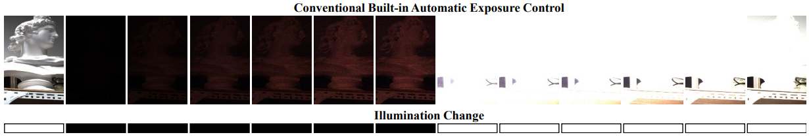

# Neural-LinUCB Auto Exposure Control for oCam

> **2025 Introduction to Reinforcement Learning Project**

> **Topic:** Real-time Auto Exposure Control System using Reinforcement Learning (Neural-LinUCB)

---

## 1. Motivation: Why is AEC Critical?
Before discussing the solution, here is why fast Auto-Exposure-Control (AEC) is vital for safety.

<p align="center">
  
  <br>
  <em><strong>Figure 1.</strong> Real-world example: Delayed exposure adaptation in a tunnel can lead to dangerous blind moments.</em>
</p>

## 2. Problem Definition: The "Blind Frame"
Traditional PID-based AE systems fail to adapt quickly to abrupt transitions. This lag creates **"Blind Frames"**—periods where the image is either completely black (under-exposed) or white (over-exposed), making object detection (YOLO) impossible.

<p align="center">
  
  <br>
  <em><strong>Figure 2.</strong> Conventional Built-in AE results in a long sequence of blind frames where objects disappear.</em>
</p>

---

## 3. Project Overview

This project addresses the instability of auto-exposure (AE) systems in robotics under drastic lighting changes. Traditional PID-based AE often fails to adapt quickly to abrupt transitions (e.g., lights turning on/off), leading to "blind" frames where visual information is lost.

To solve this, we implemented a **Neural-LinUCB (Deep Contextual Bandit)** algorithm. The agent learns to:

- **Analyze Image Features:** Extracts entropy, sharpness, and saturation from the camera feed.
- **Control Exposure Actively:** Selects the optimal exposure time to maximize image information and minimize control instability.
- **Overcome Hardware Limits:** Effectively handles physical shutter speed constraints in abrupt light transitioning environments.

## 4. Hardware & Software Requirements

### Hardware
- **Camera:** oCam-1MGN-U-T (Global Shutter USB Camera)
- **Compute:** Laptop or Embedded PC (Tested on Ubuntu 20.04)

### Software Dependencies
This project requires **Python 3.8+**.
Key libraries: PyTorch, OpenCV, NumPy, Pandas, Matplotlib

---

## 5. Experimental Results (Demo)

We compared the performance of our **Neural-LinUCB** agent against the built-in **Standard AE** in a dynamic environment (lights turning on/off).

| **Baseline (Standard AE)** | **Ours (Neural-LinUCB)** |
|:--------------------------:|:------------------------:|
|  |  |
| **Fail:** Slow adaptation, Motion blur occurs | **Success:** Fast recovery, Sharp edges maintained |

> **Result:** The Neural-LinUCB agent recovers optimal exposure **3x faster** than standard AE and significantly reduces blind frames (up to 93%) during abrupt light changes.

---

## 6. Installation

### Step 1. Clone the Repository
```bash
git clone [https://github.com/sdh123987-maker/Intoroduction-to-RL.git](https://github.com/sdh123987-maker/Intoroduction-to-RL.git)
cd Intoroduction-to-RL
```
### Step 2. Install Dependencies
```bash
pip install numpy opencv-python torch pandas matplotlib
```
## 7. How to Run

### Step 1. Connect Camera & Run Control Loop
Connect the oCam to your USB port and execute the main RL script.

Basic execution (Default Device ID: 2)

```bash
python RL_final.py
```
If your camera is at /dev/video0
```bash
python RL_final.py --device 0
```
### Arguments:

--device: Camera device index (default: 2)

--fps: Target FPS (default: 30)

--hz: Control loop frequency (default: 15)

### Step 2. Visualize Results
After stopping the script (Press ESC), a .csv log file will be generated. Use the plotting script to visualize the learning curves:

Note: Ensure the csv filename in the script matches your generated log file.

```bash
python plot.py
```
## 8. Key Features
Deep Representation Learning: Neural encoder maps high-dimensional image statistics to a latent state.

Contextual Bandit (LinUCB): Balances exploration and exploitation for exposure selection.

Safety Mechanism: Prevents penalty accumulation when hardware exposure limits are reached.

## 9. Trained Models

The trained agent consists of two key files. Both are required to load the model.

- **Encoder Weights (`.pth`):** Stores the parameters of the neural network that extracts features from images.
- **LinUCB Parameters (`.npz`):** Stores the learned contextual bandit matrices ($\theta, A^{-1}, b$) and action space.
- **Training Logs (`.csv`):** Contains step-by-step metrics (reward, exposure, image stats) for analysis.

> **Note:** To resume training or run the agent, ensure the timestamp in the filenames matches.

Author: Mingyu Kim Contact: sdh3163@naver.com
